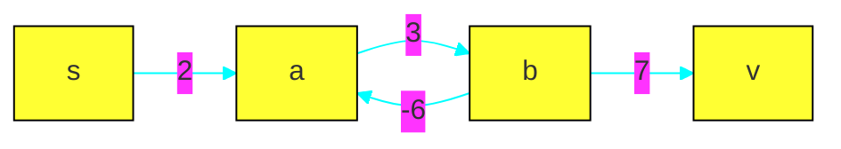

# BFS for unweighted graph SSSP
```cpp
vector<vector<int>> adj_list;
int V = adj_list.size();
vector<int> parent(V,-1);
void bfs(int v){
    vector<int> visited(V,0);
    queue<int> q;
    q.push(v);
    visited[v] = 1;
    while(!q.empty()){
        int u = q.front(); q.pop();
        for(auto x:adj_list1[u])
            if(!visited[x]){
                parent[x] = u;
                q.push(x);
                visited[x] = 1;
            }
    }
}
void printPath(int u, int v){
    if(u == v) { printf("%d", v); return; }
    printUndirectedPath(parent[u],v);
    printf("->%d",u);
}
```
# SSSP algorithms
- weight/cost of path $p=v_0,v_1,...,v_k$   
	$w(p) = \sum\limits_{i=1}^{k}w(v_{i-1}, v_i)$
- shortest path weight from $u$ to $v$  
	$\delta(u, v) = \begin{cases}  
	\text{min}\{w(p): u \xrightarrow{p} v \} & \text{ if there is a path } u\to v \\  
	\infty & \text{otherwise}  
	\end{cases}$
- **optimal sub-structure**: if $p = v_0,v_1,...,v_k$ is shortest path from $v_0$  to $v_k$, then   
	for $0\leq i\leq j\leq k$, $p_{ij} = v_i,v_{i+1},...,v_j$ is shortest path from $v_i$ to $v_j$
- for graphs with negative edge weights: if there's a  negative weight cycle on some path from $s$ to $v$, then $\delta(s,v)=-\infty$. for example:

- representing shortest path: track predecessors for each vertex $v$ in path. When at the end we reach destination, we form the path from these predecessors. so keep a `p[nVertices]` array
- **relaxation**: for each vertex $v\in V$, we maintain upper bound on weight of a shortest path from source to $v$(called shortest path estimate)
- initialization of predecessors and shortest path estimates
```cpp
void init(){
	for(v : V):
		dest[v] = INF;//don't take INF==INT_MAX for overflow reasons
		parent[v] = NULL;
	dest[src] = 0;
}
```
- relaxing an edge $(u,v)$ consists checking whether we can improve the shortest path to $v$ from source by going through $u$. If so, update those two values.
	- if $v.d\leq u.d + w(u,v)$ then the constraint that $u.d =\delta(s,u)$ and $v.d = \delta(s,v)$ is relaxed.
	```cpp
	void relax(u, v){
		if(dest[v] > dest[u] + w(u,v)){
			dest[v] = dest[u] + w(u,v);
			parent[v] = u;
		}
	}
	```
- **properties**
	- for any edge $(u,v)\in E$, holds: $\delta(s,v)\leq\delta(s,u)+w(u,v)$
	- $v.d\geq \delta(s,v)\ \forall\ v\in V$ and once $v.d = \delta(s,v)$, it never changes
	- once $v.d = \delta(s,v)$ then predecessor subgraph from $v$ is shortest path tree rooted at $s$

# Bellman-Ford algorithm
- single source shortest path algorithm $\mathcal{O}(VE)$
- lets say $p_0, p_1, ..., p_k$ is shortest path from $p_0$ to $p_k$ and define a phase as relaxation of all edges once. Then
	- before first phase, $p_0$ was done(have $p_0.d = \delta(p_0,p_0) =0$)
	- after first phase, $p_1$ is done:gotten final $p_1.d$ value equal to $\delta(p_0, p_1)$
	- after seond phase, $p_2$ is done:gotten final $p_2.d$ value equal to $\delta(p_0, p_2)$
	- after $k^{th}$ phase, $p_k$ is done:gotten final $p_k.d$ value equal to $\delta(p_0, p_k)$
- so $n$ phases calculate shortest path with upto $n+1$ edges in them correctly
- implementation:
```cpp
struct edge{ int a, b, cost;};
int V, E, v;
vector<edge> edge_list;
vector<int> d(V, INF);
vector<int> p(V, -1);
void solve(){
    d[v] = 0;
    for (int i=0; i<V-1; ++i){
        bool any = false;
        for (auto edge : edge_list)
            if (d[edge.a] < INF && d[edge.b] > d[edge.a] + edge.cost){
                d[edge.b] = d[edge.a] + edge.cost;
                p[edge.b] = edge.a;
                any = true;
            }
        if(!any) break;
    }
}
void retrievePathForVertex(int t){
    if (d[t] == INF){
        printf("No path from %d to %d.\n", v, t);
        return;
    }
    vector<int> path;
    for (int curr = t; curr != -1; curr = p[curr])
        path.push_back(curr);
    reverse(path.begin(), path.end());
    cout << "Path from " << v << " to " << t << ":\n\t";
    for (int x : path)
        cout << x << ' ';
    cout << '\n';
}
int shortestDistance(int t){ return d[t]; }
```
- things about the implementation:
    - the `i` variable loop only goes to `V-1` because of the earliear fact about phases
    - because of the `any` boolean variable the `i` variable for loop can be replaced with `while(1)` but the for loop tells that the time complexity is $\mathcal{O}(VE)$
    - `d[edge.a] < INF` check for edges with negative weights
    - the `any` variable improves average case performance because it terminates the algorithm when no relaxation was done in that phase


## Negative cycles
- a shortest path(or any path) can contain of atmost $V$ vertices.  So $V-1$ phases are enough for the algorithm. If after these $V-1$ phases we run one more phase and it performs atleast one more relaxation then the path contains negative weight cycle.
- finding vertices in negative cycle
    - remember the vertex $x$ for which relaxation was performed in that extra step  
      x will either be in the negative cycle or is reached from source through that cycle
    - from $x$, traverse its predecessor subgraph $V$ times, then we'll get a vertex $y$ in the negative cycle
    - traverse predecessor subgraph of $y$ until we get $y$ again, all those traversed vertices will be in the negative cycle

	
	```cpp
	void solve(){
		vector<int> d (V, INF);
		d[v] = 0;
		vector<int> p (V - 1);
		int x;
		for (int i=0; i<V; ++i){
			x = -1;
			for (auto edge : edge_list)
				if (d[edge.a] < INF && d[edge.b] > d[edge.a] + edge.cost){
					d[edge.b] = max (-INF, d[edge.a] + edge.cost);  //this for avoiding integer overflow
					p[edge.b] = edge.a;
					x = edge.b;
				}   
		}
		if (x == -1)
		cout << "No negative cycle from " << v;
		else{
			int y = x;
			for (int i=0; i<V; ++i) y = p[y];
			vector<int> path;
			for (int cur=y; ; cur=p[cur]){
				path.push_back (cur);
				if (cur == y && path.size() > 1) break;
			}
			reverse (path.begin(), path.end());
			cout << "Negative cycle: ";
			for (size_t i=0; i<path.size(); ++i) cout << path[i] << ' ';
			cout << '\n';
		}
	}
	```


# Dijkstra's Algorithm
- sssp algorithm, won't work on graphs with negative edges
```cpp
#define ii pair<int, int>
vector<vector<pair<int, int>>> adj_list;
int V = adj_list.size();
void Dijkstra(int src){   
    vector<int> dist(V, INF); 
    vector<int> p(V, -1); 
    dist[src] = 0;
    priority_queue< ii, vector<ii>, greater<ii> > pq; //contains pairs of (distance of vertex from src, vertex)
    pq.push(ii(0, src));
    while (!pq.empty()) {
        ii front = pq.top(); pq.pop(); // greedy: get shortest unvisited vertex
        int d = front.first, u = front.second;
        if (d > dist[u]) continue;//imp
        
        for (auto i : adj_list[u]) {
            int v = i.first, weight = i.second;
            if (dist[u] + weight < dist[v]) {
                dist[v] = dist[u] + weight;
                p[v] = u;
                pq.push(ii(dist[v], v));
            } 
        } 
    }
    // useful values are in dist and p
}
```
- about the algorithm
	- when pushing new values in the priority queue, we can't remove the old value for that vertex. This causes dupliate values in the priority queue, to deal with this add the line commented with imp.
	- we can use set instead of priority queue which won't cause duplicate entries as in last point. But this implementation is usually faster with priority queue
	- with set implementation we can store just vertex indices instead of distance and vertex index pairs. For that we'll have to overload comparison operator used by the set so that it compares two vertex indices with distances stored in distance array.
		since relaxation changes the distance array and set won't update according to it automatically, so we have to remove the vertex from set before relaxing it and insert it again afterwards.
		this optimization can be helpful when data types of larger size are used as distances.
	- since the algorithm uses priority_queue/set operations which cost $\mathcal{O}(lgV)$ and those operations are called once for each vertex and each edge so time complexity of algorithm $\mathcal{O}(V\lg V + E\lg V)$

# Floyd-Warshall's all pair shortest path
- $\mathcal{O}(V^3)$ dynamic programming
```cpp
//initially d[i][i] = 0, d[i][j] = w(i, j) or infinity
for (int k = 0; k < n; ++k) // k->i->j
for (int i = 0; i < n; ++i)
for (int j = 0; j < n; ++j)
	if (d[i][k] < INF && d[k][j] < INF)
		d[i][j] = min(d[i][j], d[i][k] + d[k][j]);
```
- about algorithm
	- the if condition can handle negative edge weights
	- a parent array can be stored to get the shortest paths
	- for real weights, floating point errors can accumulate fast. So handle them this way
	```cpp
	if (d[i][k] + d[k][j] < d[i][j] - EPS) //EPS: error term
		d[i][j] = d[i][k] + d[k][j];
	```
- other problems solved with the idea
	- checking if two vertices are connected directly/indirectly: now `d` is a boolean matrix
		`d[i][j] |= (d[i][k] & d[k][j]);`
	- minmax
		`d[i][j] = min(d[i][j], max(d[i][k], d[k][j]));`
	- negative cycles: set `d[i][i] = INF` and if at the end of algorithm `d[i][i] != INF` for any `i` then negative cycle exists
	- diameter of graph: maximum entry in the matrix, ignoring the `INF` values
