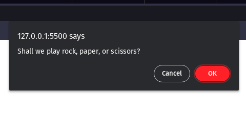
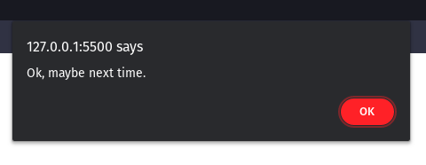
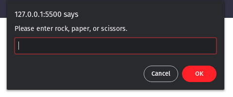
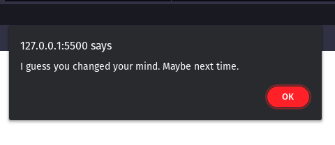
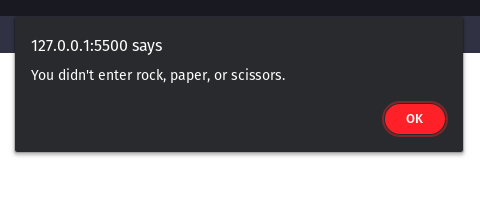
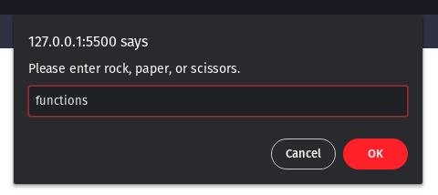
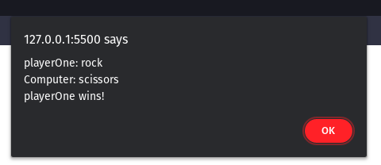
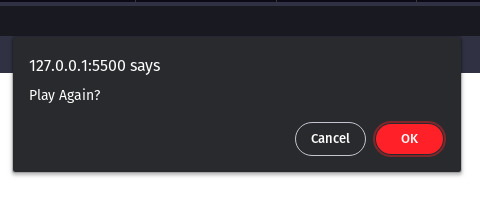

# Rock-Paper-Scissor

Below written is a code of a rock-paper-scissor game using functions in javascript.
```javascript
const initGame = () => {
    const startGame = confirm("Shall we play rock, paper, or scissors?");
    // Conditional Operator
    startGame ? playGame() : alert("Ok, maybe next time.");
  };
  // Use of arrow functions
  // Game flow function
  const playGame = () => {
    while (true) {
      let playerChoice = getPlayerChoice();
      playerChoice = updatePlayerChoice(playerChoice);
      if (playerChoice === "") {
        invalidChoice();
        continue;
      }
      if (!playerChoice) {
        decidedNotToPlay();
        break;
      }
      playerChoice = evaluatePlayerChoice(playerChoice);
      if (!playerChoice) {
        invalidChoice();
        continue;
      }
      const computerChoice = getComputerChoice();
      const result = determineWinner(playerChoice, computerChoice);
      displayResult(result);
      if (askToPlayAgain()) {
        continue;
      } else {
        thanksForPlaying();
        break;
      }
    }
  };
  
  const getPlayerChoice = () => {
    return prompt("Please enter rock, paper, or scissors.");
  };
  
  const updatePlayerChoice = (playerChoice) => {
    if (playerChoice || playerChoice === "") {
      // Use of predefined functions
      return playerChoice.trim().toLowerCase();
    } else {
      return false;
    }
  };
  // trim() removes all the extra spaces in a string.
  // toLowerCase converts the string into lowercase string.
  
  const decidedNotToPlay = () => {
    alert("I guess you changed your mind. Maybe next time.");
  };
  
  const evaluatePlayerChoice = (playerChoice) => {
    if (
      playerChoice === "rock" ||
      playerChoice === "paper" ||
      playerChoice === "scissors"
    ) {
      return playerChoice;
    } else {
      return false;
    }
  };
  
  const invalidChoice = () => {
    alert("You didn't enter rock, paper, or scissors.");
  };
  
  const getComputerChoice = () => { 
    const randomNumber = Math.floor(Math.random() * 3);
    const rpsArray = ["rock", "paper", "scissors"];
    return rpsArray[randomNumber];
  };
   
    // The Math.floor() function always rounds down and returns the largest integer less than or equal to a given number.

    // The Math.random() function returns a number that's greater than or equal to 0 and less than 1.
  
  const determineWinner = (player, computer) => {
    const winner =
      player === computer
        ? "Tie game!"
        : player === "rock" && computer === "paper"
        ? `playerOne: ${player}\nComputer: ${computer}\nComputer wins!`
        : player === "paper" && computer === "scissors"
        ? `playerOne: ${player}\nComputer: ${computer}\nComputer wins!`
        : player === "scissors" && computer === "rock"
        ? `playerOne: ${player}\nComputer: ${computer}\nComputer wins!`
        : `playerOne: ${player}\nComputer: ${computer}\nplayerOne wins!`;
  
    return winner;
  };
  
  const displayResult = (result) => {
    alert(result);
  };
  
  const askToPlayAgain = () => {
    return confirm("Play Again?");
  };
  
  const thanksForPlaying = () => {
    alert("Ok, thanks for playing.");
  };
  
  initGame();
  ```
 Following are the screenshots after running a java file in browser with above code written in it.

 At first **initGame()** function will execute like this

  

  If user clicks on **Cancel** button , confirm() method will return false and a pop will generate as we can see in image below.

  

  If user clicks on **OK** button , confirm() method will return true and **playGame()** function will
  execute.

  In **playGame()** function at first **getPlayerChoice()** will execute like this 

  

  If user clicks on **Cancel** button , *decidedNotToPlay()* function will execute and a pop up will generate as we can see in image below.

  

  If user clicks on **Ok** button, **updatePlayerChoice** function will execute now if user clicks on **OK** button without typing anything then an empty string will gets return and **invalidChoice()** function will execute as we can see in image below.

  

  If user enters something in prompt message then **evaluatePlayerChoice()** function will execute.

  Now if the choice entered by user is other than "rock", "paper" or "scissor" like this 
  
  
  
 then **evaluatePlayerChoice()** function will return false and again **invalidChoice()** function will execute , if choice entered by user is  "rock" , "paper" or "scissor" then that choice will get stored in *plyerChoice* variable.

 After that **getComputerChoice()** function will execute and a random choice from "rock" , "paper" or "scissor" will get stored in *computerChoice* variable as a choice made by computer. Then **determineWinner()** function will execute.

 Now **displayResult()** function will execute and result will be displayed on browser like this

 

 After that user will be asked to play game agin by executing **askToPlayAgain()** function like this

 

 If user clicks on **Cancel** button then a false value will gets return and **thanksForPlaying()** function will execute like this

 

 and if user clicks on **OK** button then game will start again.

 ### This is how we use functions in javascript to make our code simple and easy to understand.


